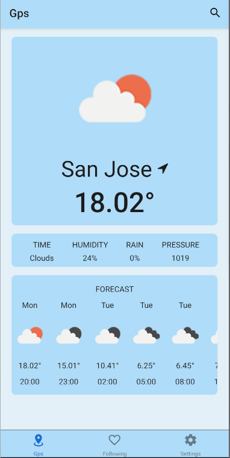
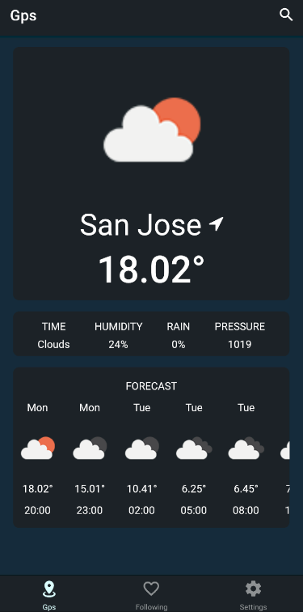
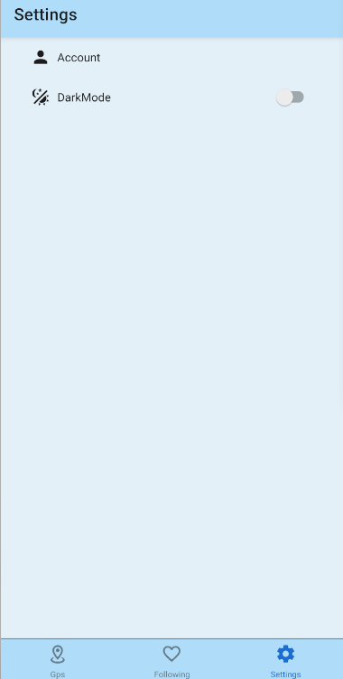
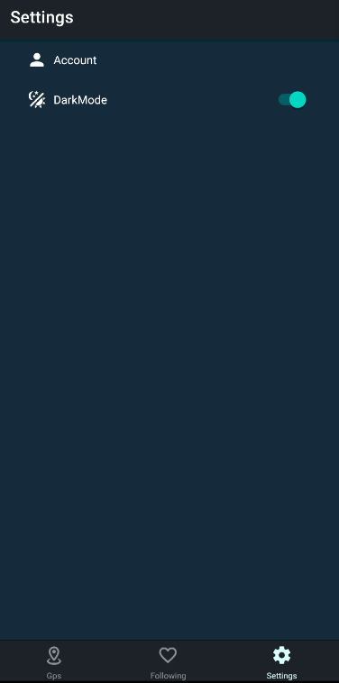
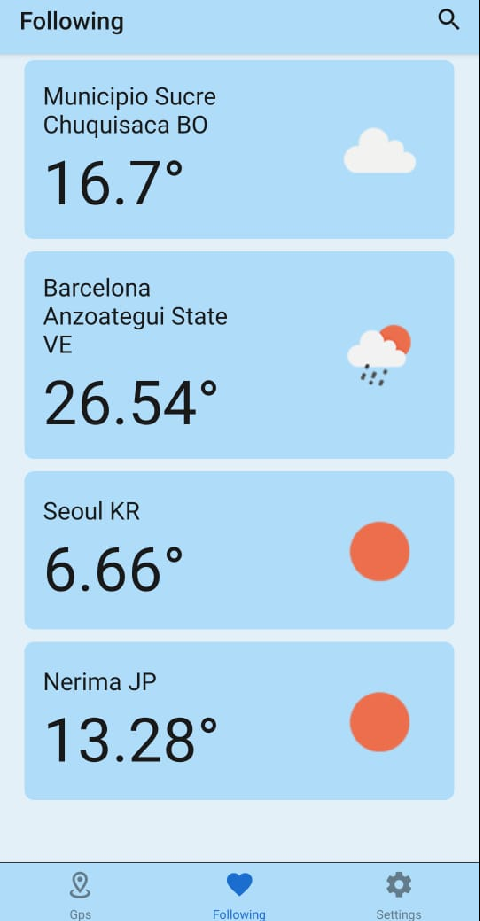
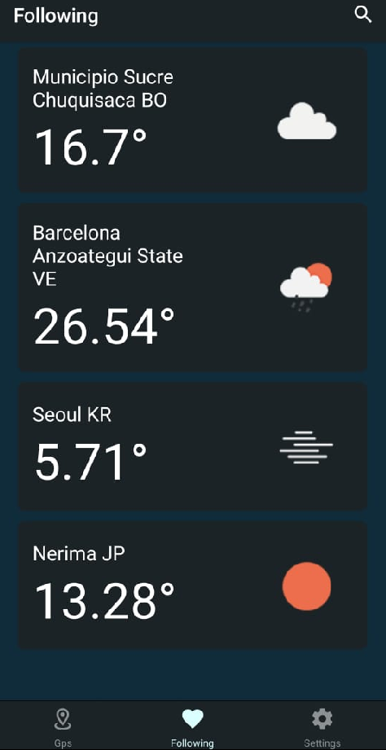

# Weathering With You (WWU)

## Description

Weather forecast with local weather, accurate hourly weather forecast.

The WWU app is very easy to use. Open the app, enable location and then you will receive weather forecasts at your current location. Then the weather app report provides the current weather forecast, weather observations around the world.

### Features

- ✨ Automatic positioning.

- ✨ Search City.

- ✨ Add and delete following.

- ✨ The weather forecast is very reliable and accurate.

- ✨ Add and track weather report from multiple locations around the world.

- ✨ Multi-unit configuration. No temperature change between Celsius and Fahrenheit.

- ✨ The weather, humidity, rainfall probability and pressure provide a reference of the day's data.

- ✨ Set the dark theme.

### Screenshots

## Technologies used

- Typescript
- Firebase
- Node
- Expo
- Npm

## How to Install and Run the Project.

### Installing dependencies

- Node
- JDK 11
- Android Studio
- Emulator or Android device

### Run the project

- Clone the repository.
- Install the node dependencies with `npm install`.
- In the terminal run the following command `npm start`.

## Credits

<a href="https://github.com/arthurchina92">@arthurchina92</a>,
<a href="https://github.com/McFly1208">@McFly1208</a>,
<a href="https://github.com/EliasCode79">@EliasCode79</a>,
<a href="https://github.com/Matarratas777">@Matarratas777</a>,
<a href="https://github.com/IvanGodinez21">@IvanGodinez21</a>
