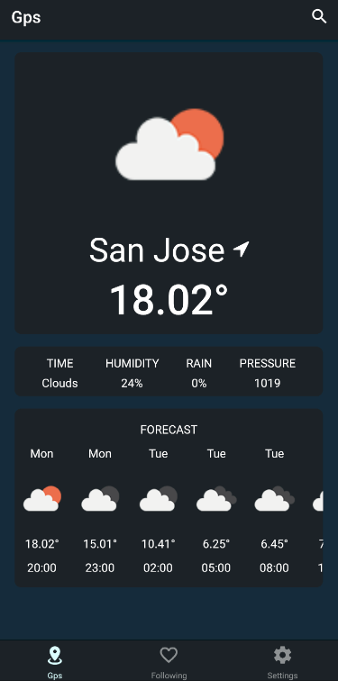
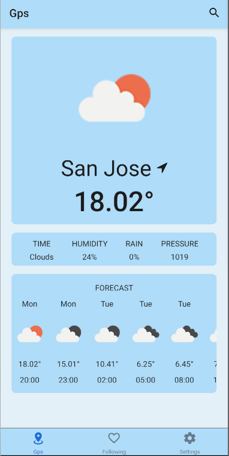
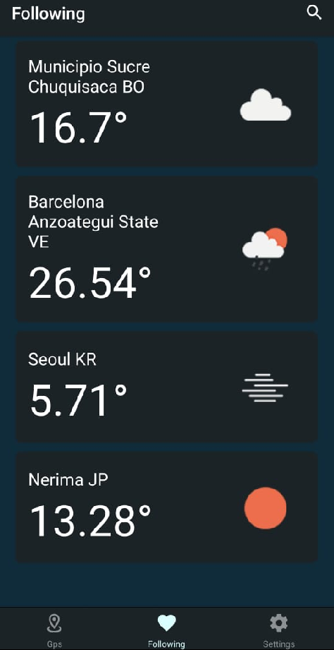
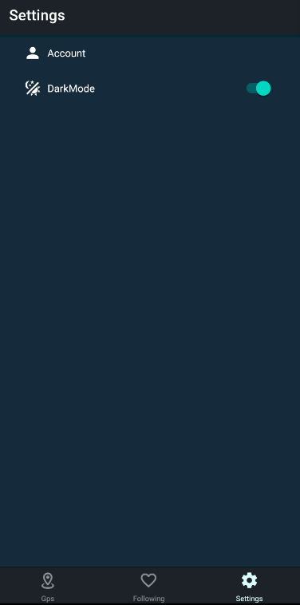

# Weathering With You (WWU)

## Table of contents

- [Description](#Description)
  - [Badges](#Badges)
  - [Features](#Features)
  - [Screenshots](#Screenshots)
- [Usage](#Usage)
  - [Installing software requirements](#Installing-software-requirements)
  - [Installing project dependencies](#Installing-project-dependencies)
  - [Running the project](#Running-the-project)
    - [Any supported platform](#Any-supported-platform)
    - [Android](#Android)
    - [iOS](#iOS)
  - [Running tests](#running-tests)
- [Technologies used](#Technologies-used)
- [Credits](#Credits)

## Description

Weather forecast with local weather, accurate hourly weather forecast.

The WWU app is very easy to use. Open the app, enable location and then you will receive weather forecasts at your current location. Then the weather app report provides the current weather forecast, weather observations around the world.

### Badges

| Code analyzer         | Status                                                                                                                                                                                                                                                             |
| --------------------- | ------------------------------------------------------------------------------------------------------------------------------------------------------------------------------------------------------------------------------------------------------------------ |
| Codacy (Code Quality) | [](https://app.codacy.com/gh/BrightCoders-Institute/BCDIC22-RN-proyecto-final-team3/dashboard?utm_source=gh&utm_medium=referral&utm_content=&utm_campaign=Badge_grade)       |
| Codacy (Coverage)     | [](https://app.codacy.com/gh/BrightCoders-Institute/BCDIC22-RN-proyecto-final-team3/dashboard?utm_source=gh&utm_medium=referral&utm_content=&utm_campaign=Badge_coverage) |

### Features

- :sparkles: Automatic positioning.
- :sparkles: Search locations.
- :sparkles: Add and delete following.
- :sparkles: The weather forecast is very reliable and accurate.
- :sparkles: Add and track weather report from multiple locations around the world.
- :sparkles: Multi-unit configuration. No temperature change between Celsius and Fahrenheit.
- :sparkles: The weather, humidity, rainfall probability and pressure provide a reference of the day's data.
- :sparkles: Set the dark theme.
- :sparkles: Synced with email or Google account.

<details open>
  <summary><h3>Screenshots<h3></summary>
  <table>
    <thead>
      <tr>
        <th style="text-align: center">Dark mode</th>
        <th style="text-align: center">Light mode</th>
      </tr>
    </thead>
    <tbody>
      <tr>
        <td></td>
        <td></td>
      </tr>
      <tr>
        <td></td>
        <td></td>
      </tr>
      <tr>
        <td></td>
        <td></td>
      </tr>
    </tbody>
  </table>
</details>

## Usage

### Installing software requirements

#### Required

- Node
- Emulator or Android device

#### Optional

- JDK 11
- Android Studio

### Installing project dependencies

```
npm install
```

### Running the project

#### Any supported platform

```
npm start
```

#### Android

```
npm run android
```

#### iOS

```
npm run ios
```

### Running tests

```
npm run test
```

## Technologies used

- Expo
- Firebase
- Node
- OpenWeatherMap API
- TypeScript

## Credits

- [@arthurchina92](https://github.com/arthurchina92)
- [@EliasCode79](https://github.com/EliasCode79)
- [@IvanGodinez21](https://github.com/IvanGodinez21)
- [@Matarratas777](https://github.com/Matarratas777)
- [@McFly1208](https://github.com/McFly1208)
